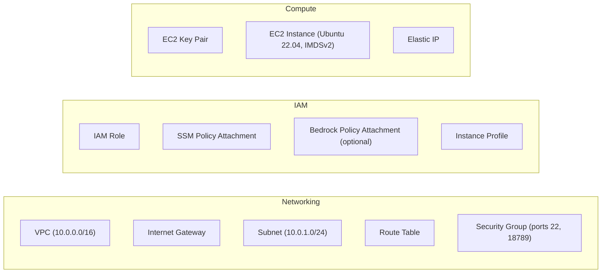
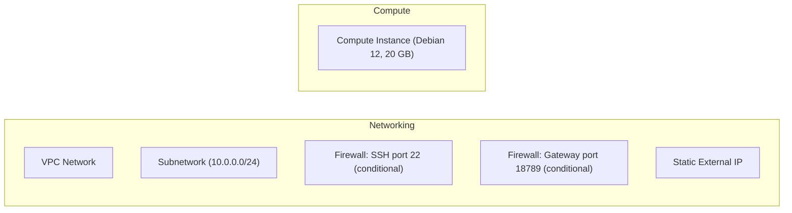
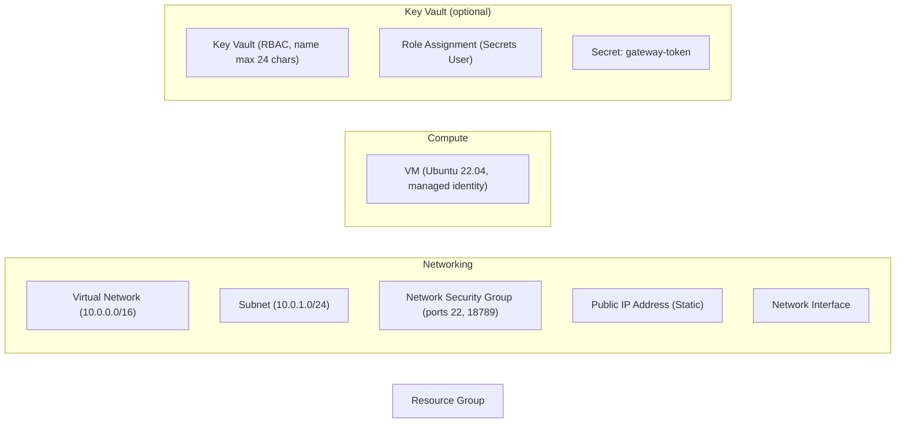

# clawops

[](https://www.npmjs.com/package/@clawops/cli)
[](https://www.npmjs.com/package/@clawops/cli)

MCP-native infrastructure ops for OpenClaw — with read-only mode, destructive-action confirmation, and audit logs built in.

**clawops** is a CLI and [MCP](https://modelcontextprotocol.io/) server for deploying and operating
self-hosted [OpenClaw](https://github.com/openclaw/openclaw) instances. Provision on AWS, GCP,
Azure, or any Linux VM — then manage day-to-day operations from the terminal, or let Claude Code
and Cursor drive them through typed MCP tools with explicit safety controls.

---

## What's new in v1.5.0

**`clawops mcp wire`** — wire the OpenClaw gateway's own AI as an MCP client of clawops.
Once wired, in-conversation commands like "check if my stack is healthy" or "show me the last 20
log lines" invoke the real `clawops` CLI rather than having the gateway AI guess.

```bash
clawops mcp wire                   # wire the default stack
clawops mcp wire --stack prod      # target a named stack
clawops mcp wire --force           # bypass gateway version check
```

Version-gated: requires OpenClaw ≥ 2026.4 on the gateway side. If the version is older, the
command surfaces a clear upgrade prompt and exits cleanly.

The `clawops setup` wizard now also asks at the end of a successful deploy:
*"Should the OpenClaw gateway's AI also be able to manage this stack?"* — accepting wires the
client automatically over the same SSH session.

---

## What's new in v1.4.0

**`clawops monitor`** — live dashboard for any deployed stack. Shows gateway health, container
status, CPU/memory, disk usage, and a rolling log tail. Refreshes on an interval with `[r]`,
toggles logs with `[l]`, and quits with `[q]`.

Run without `--stack` to get an **interactive stack picker** first — probes all registered stacks
in parallel, shows only running ones by default, and lets you toggle to a full list (`[a]`) where
not-deployed stacks can be deleted from the registry with `[d]`. Press `[s]` inside the dashboard
to go back to the picker.

```bash
clawops monitor              # interactive stack selection → dashboard
clawops monitor --stack prod # jump straight to a named stack
clawops monitor --stack prod | cat  # one-shot snapshot for CI
```

**`clawops_monitor` MCP tool** — same snapshot as a single structured JSON call, so Claude Code
and Cursor can check stack health without opening a terminal.

**`clawops stacks delete` guard** — now blocks deletion of a still-deployed stack and requires
`--force` to remove from the registry without tearing down cloud resources first.

---

## Who this is for

- **OpenClaw users** who want the simplest path to self-hosting across cloud or local VMs, with
  reliable deploy, status checks, logs, backups, and upgrades in a single CLI.
- **Claude Code / Cursor / MCP users** looking for a real-world reference implementation of safe
  infrastructure operations through MCP — typed tool schemas, read-only mode, destructive-action
  confirmation, and audit logs.
- **Self-hosted AI and local-first developers** who want to run their own AI assistant without
  committing to Kubernetes, a managed SaaS platform, or a single cloud provider.

---

## What clawops does

- Provisions and tears down OpenClaw infrastructure on **AWS, GCP, Azure, and local VMs** using
  the Pulumi Automation API (embedded — no `pulumi` binary required).
- Manages day-to-day operations: status, logs, SSH, tunnels, config, agents, gateway, backups.
- Exposes every operation as a **typed MCP tool** so AI agents can drive ops safely.
- Enforces a **plan → review → apply** discipline for cloud deployments.
- Emits **JSON output everywhere** (`--json`) for scripting and automation.
- Never stores cloud credentials — reads them from your environment's existing CLI profiles.

## What clawops does not do

- **No high availability or clustering.** Optimized for single-node deployments.
- **No Kubernetes.** It deploys to VMs, not container orchestration platforms.
- **No OpenClaw skill/agent authoring.** clawops manages infrastructure; what runs on it is up to
  you and OpenClaw.
- **No TLS or domain automation** (yet). Bring your own reverse proxy or see
  [`docs/limitations.md`](docs/limitations.md) for the manual path.
- **No credential storage.** Cloud credentials must be configured in your environment before using
  clawops. They are never written to `~/.clawops/config.json`.
- **No native Windows.** WSL2 is fully supported; see [`docs/support-matrix.md`](docs/support-matrix.md).

---

## Quick Start

```bash
npm install -g @clawops/cli
clawops setup
```

`clawops setup` is an interactive wizard that gets OpenClaw running in about 2 minutes. It
handles everything in one flow — no config files to write by hand, no commands to memorize.

### What the wizard does

**Step 1 — Choose a deployment target**

Pick an existing server you can SSH into (Linux or macOS), or a new cloud VM on AWS, GCP, or
Azure. Cloud deployments walk you through authenticating with the provider CLI if you aren't
already signed in.

**Step 2 — Pick an LLM provider**

Choose from Anthropic, OpenAI, Amazon Bedrock, Ollama, or others. The wizard prompts for your
API key and saves it locally (in `~/.clawops/secrets/`, chmod 600) — it is never sent anywhere
except to OpenClaw on the target host when the config is applied.

**Step 3 — Add chat integrations (optional)**

Select any combination of Discord, Telegram, Slack, WhatsApp, or Teams. The wizard collects each
integration's bot token the same way as the API key — paste it in, reference an env var, or point
to a file.

**Step 4 — Wire your AI editor**

Select which AI apps should have access to clawops — Claude Desktop, Claude Code, Cursor,
Windsurf, VS Code, and Zed are all supported. The wizard writes an MCP server entry into each
app's config file using the absolute binary path so the app can launch it independently.

**Step 5 — Deploy**

The wizard bootstraps OpenClaw on the target host over SSH (installs Docker, pulls the image,
starts the container), applies your LLM and integration config, generates a gateway auth token,
and prints a direct dashboard URL:

```
✔ All done! OpenClaw is running.
ℹ Open dashboard: http://192.168.1.50:18789?token=<your-token>
ℹ Token saved to ~/.clawops/secrets/GATEWAY_TOKEN_my-stack
```

**Prerequisites:** Node.js ≥ 22, an SSH key, and either an SSH-reachable Linux/macOS host or a
cloud account with CLI credentials configured (`aws configure`, `gcloud auth login`, or `az login`).

For a full narrated walkthrough with example output, see [`docs/demo-script.md`](docs/demo-script.md).

---

### Manual setup — existing server

If you prefer step-by-step control, or are adding clawops to an already-running deployment:

```bash
npm install -g @clawops/cli

clawops doctor   # verify environment

clawops init --provider local --host 192.168.1.50 --user ubuntu --key-path ~/.ssh/id_ed25519
clawops up       # installs Docker + OpenClaw over SSH
clawops status
```

See [`docs/examples/local-vm.md`](docs/examples/local-vm.md) for SSH prerequisites, firewall
setup, and troubleshooting.

### Manual setup — cloud (AWS)

```bash
npm install -g @clawops/cli

# Requires AWS credentials in your environment (AWS_PROFILE or ~/.aws/credentials)
clawops init --provider aws

# Edit ~/.clawops/config.json — set stateUrl to your S3 bucket

clawops plan --provider aws --stack default --out /tmp/plan.json
clawops apply /tmp/plan.json
```

---

## Connect an AI editor

The `setup` wizard handles this automatically (Step 4). To wire or re-wire editors at any time:

```bash
clawops mcp install
```

This opens the same interactive checkbox used in the wizard — select Claude Desktop, Claude Code,
Cursor, Windsurf, VS Code, or Zed and clawops writes the MCP entry into each app's config using
the correct absolute binary path.

To add the entry manually instead, paste this into your editor's MCP config:

```json
{
  "mcpServers": {
    "clawops": {
      "command": "/path/to/clawops",
      "args": ["mcp", "serve", "--read-only"]
    }
  }
}
```

Replace `/path/to/clawops` with the output of `which clawops`. Config file locations:

| App | Path |
|---|---|
| Claude Desktop (macOS) | `~/Library/Application Support/Claude/claude_desktop_config.json` |
| Claude Desktop (Linux) | `~/.config/Claude/claude_desktop_config.json` |
| Claude Code | `~/.claude.json` |
| Cursor | `~/.cursor/mcp.json` |
| Windsurf | `~/.codeium/windsurf/mcp_config.json` |
| VS Code (macOS) | `~/Library/Application Support/Code/User/mcp.json` |
| VS Code (Linux) | `~/.config/Code/User/mcp.json` |
| Zed | `~/.config/zed/settings.json` (key: `context_servers`) |

**Start with `--read-only`** — it enables status, logs, config reads, and diagnostics while
blocking mutations. Remove it only after reviewing
[`docs/security/mcp-safety.md`](docs/security/mcp-safety.md).

Destructive tools (`clawops_destroy`, `clawops_up`, `clawops_config_set`, etc.) require explicit
confirmation before executing — they will never run silently.

For HTTP mode setup see [`docs/mcp/`](docs/mcp/).

---

## Day-to-day operations

```bash
clawops status              # Stack outputs: IP, gateway URL, SSH info
clawops logs -f             # Tail OpenClaw logs over SSH
clawops ssh                 # Interactive SSH session
clawops ssh --command "docker ps"

clawops config get maxAgents
clawops config set maxAgents 8

clawops tunnel              # Port-forward gateway UI to localhost

clawops destroy --yes       # Destroy cloud-provider stack
clawops down --yes          # Destroy local-provider stack
```

---

## Commands

| Command | Description |
|---|---|
| `setup` | First-run wizard — guided LLM, integrations, and deploy-plan generation |
| `init` | Register a stack in `~/.clawops/config.json` without provisioning |
| `up` | Provision or update stack (`--dry-run` for preview) |
| `down` | Destroy local-provider stack (requires `--yes`; `--dry-run` shows current outputs) |
| `destroy` | Destroy cloud-provider stack with confirmation prompt (`--dry-run` shows current outputs) |
| `status` | Show stack outputs: IP, gateway URL, region, provisioned time |
| `plan` | Generate a deploy-plan JSON artifact (dry-run safe) |
| `apply` | Apply a previously reviewed plan file (`--dry-run` validates and shows diff without applying) |
| `ssh` | Interactive SSH session or run a remote command |
| `logs` | Stream OpenClaw logs (`-f`, `--tail N`, `--since 5m`) |
| `tunnel` | Local port-forward to gateway UI over SSH |
| `config` | Get/set remote OpenClaw config values (`--dry-run` shows would-write JSON) |
| `agents` | List or restart OpenClaw agents |
| `gateway` | Restart the OpenClaw gateway service |
| `backup` | Create or restore an OpenClaw state backup |
| `stacks` | List named stacks and their state |
| `doctor` | Check Node version, config, SSH key, provider credentials, and Pulumi home |
| `secret` | Manage secrets: `list`, `set`, `delete`, `rotate`, `audit` |
| `monitor` | Live dashboard: gateway health, container stats, log tail, stack picker |
| `mcp serve` | Start the embedded MCP server (stdio or HTTP) |
| `mcp install` | Interactively wire clawops into AI editors |
| `mcp wire` | Wire the gateway's AI as an MCP client of clawops |
| `help` | List all commands and global flags |

Full flag reference: `clawops <command> --help`

---

## Plan → Apply workflow

For non-local providers, clawops enforces a review-before-apply discipline:

```bash
# 1. Generate a plan — runs `pulumi preview` internally, produces JSON
clawops plan --provider aws --region us-east-1 --out /tmp/plan.json

# 2. Review plan.json — the `diff` field shows projected changes at plan-generation time
cat /tmp/plan.json | jq .diff

# 3. Apply — reads and validates the plan file, then runs `pulumi up`
clawops apply /tmp/plan.json

# Without --yes, apply prompts: "Continue? (y/N)"
clawops apply /tmp/plan.json --yes    # skip prompt in automation
```

The plan JSON conforms to `spec/deploy-plan.schema.json` (AJV-validated) and captures reviewed
intent: provider, region, instance type, CIDR ranges, and OpenClaw version. `apply` re-runs
`pulumi up` using those parameters against the current live state — it does not replay a locked
execution artifact. Review and apply in the same session to minimize drift risk.

See [`docs/plan-apply.md`](docs/plan-apply.md) for full semantics, drift guidance, and the safe CI pattern.

---

## MCP server

clawops ships an embedded [MCP](https://modelcontextprotocol.io/) server. Claude Code, Cursor, and
any MCP-compatible agent can drive deployments without leaving the chat interface.

### Wire your editor

```bash
clawops mcp install   # interactive checkbox — writes config for selected apps
```

The wizard resolves the absolute binary path automatically so app launchers can find `clawops`
without inheriting your shell's `PATH`. See [Connect an AI editor](#connect-an-ai-editor) above
for manual config paths.

### Wire the gateway AI

The OpenClaw gateway runs its own AI agent. Once wired, that agent can call clawops directly
instead of guessing at infrastructure state:

```bash
clawops mcp wire --stack prod   # write MCP client entry into gateway config + restart
```

Requires OpenClaw ≥ 2026.4 on the gateway. The `clawops setup` wizard offers this step
automatically after a successful deploy.

### Stdio mode (Claude Code / Cursor / VS Code)

Start the server manually or confirm your config is correct:

```bash
clawops mcp serve --read-only   # safe for first evaluation
clawops mcp serve               # full mode — enables provisioning, config write, ssh exec
```

### HTTP mode (remote / multi-client)

```bash
clawops mcp serve --http 3333 --bind 127.0.0.1
# MCP HTTP server listening on 127.0.0.1:3333
```

Do not bind to a non-loopback address without additional authentication controls in front of it.

### Available tools

| Tool | Toolset | Description |
|---|---|---|
| `clawops_status` | read | Show stack outputs |
| `clawops_logs_tail` | read | Tail OpenClaw logs |
| `clawops_config_get` | read | Read a remote config value |
| `clawops_agents_list` | read | List running agents |
| `clawops_task_status` | read | Poll a long-running task |
| `clawops_stacks_list` | admin | List all stacks and their state |
| `clawops_up` | cli | Provision or update a stack |
| `clawops_plan` | cli | Generate a deploy plan |
| `clawops_apply` | cli | Apply a plan file |
| `clawops_ssh_exec` | cli | Run a command over SSH |
| `clawops_config_set` | cli | Write a remote config value |
| `clawops_destroy` | cli | Destroy a stack (elicits confirmation) |
| `clawops_workflow_deploy_app` | workflow | End-to-end deploy: plan → confirm → apply → status |

`read` toolset tools are available in `--read-only` mode. All other toolsets require full mode.
Destructive tools require explicit confirmation (elicitation) unless `yes: true` is passed.

See [`docs/security/tool-risk-matrix.md`](docs/security/tool-risk-matrix.md) for the full risk
classification of every tool.

---

## Configuration

Config lives at `~/.clawops/config.json` (override with `$CLAWOPS_HOME`).

```json
{
  "version": 1,
  "defaults": {
    "provider": "aws",
    "stack": "default"
  },
  "stacks": {
    "default": {
      "provider": "aws",
      "region": "us-east-1",
      "stateUrl": "s3://my-clawops-state"
    }
  },
  "ssh": {
    "keyPath": "~/.clawops/id_ed25519",
    "knownHostsPath": "~/.clawops/known_hosts"
  }
}
```

**Cloud credentials are never stored in config** — clawops reads them from the environment:

| Provider | Credential source |
|---|---|
| AWS | `AWS_PROFILE` or standard AWS credential chain (`~/.aws/credentials`) |
| GCP | `GOOGLE_APPLICATION_CREDENTIALS` or `gcloud auth application-default login` |
| Azure | `AZURE_CLIENT_ID` / `AZURE_CLIENT_SECRET` or `az login` |
| Local | SSH host + key configured in `stacks[name].localOpts` |

---

## Known limitations

See [`docs/limitations.md`](docs/limitations.md) for the full list. Key points:

- **Single-node deployments only** — not a high-availability or clustering platform.
- **`clawops apply` is not an immutable plan execution** — see [`docs/plan-apply.md`](docs/plan-apply.md).
- **No TLS/domain automation** in the current release.
- **MCP tools execute privileged operations** — use `--read-only` for first evaluation.

---

## Architecture

```
clawops
├── src/cli/          citty-based commands (one file per verb)
├── src/config/       ~/.clawops/config.json management
├── src/providers/    Cloud adapters (AWS, GCP, Azure, local)
│   ├── aws/          Pulumi inline program + ProviderAdapter
│   ├── gcp/
│   ├── azure/
│   └── local/        SSH bootstrap (no Pulumi)
├── src/pulumi/       Pulumi Automation API wrapper + output helpers
├── src/transport/    SSH client (ssh2) + connection pool + tunnels
├── src/mcp/          MCP server, tool handlers, progress tracking
├── src/plan/         Maker plan generation, AJV validation, apply
├── src/output/       ASCII table, spinner, JSON, human-readable output
├── src/errors/       Typed error hierarchy with exit codes
└── spec/             Machine-readable ground truth (JSON Schema, YAML)
```

Key design decisions:

- **Pulumi Automation API (embedded):** no `pulumi` binary required; Pulumi home is sandboxed to `~/.clawops/.pulumi`; stack programs are inline TypeScript closures
- **State in cloud blob storage:** GCS (`gs://`), S3 (`s3://`), Azure Blob — no local state files, no `pulumi.yaml`
- **SSH via `ssh2`:** never shells out to `/usr/bin/ssh`; TOFU host verification against `~/.clawops/known_hosts`; connection pool with 5-min idle TTL
- **Plan → apply discipline:** every non-local deployment goes through `generatePlan()` → review → `applyPlan()`; destructive changes always require human review of the plan JSON
- **MCP-first:** every CLI operation has a typed MCP tool; schemas generated from `spec/mcp-tools.yaml`; all destructive tools use elicitation

See [`docs/architecture.md`](docs/architecture.md) for a full narrative, and [`docs/decisions/`](docs/decisions/) for ADRs.

### Cloud provider stacks

Each cloud provider is an inline Pulumi program that creates the resources below. All three share the same outputs (`publicIp`, `gatewayUrl`, `sshHost`, `sshPort`, `sshUser`) consumed by the SSH and config-overlay layers.

#### AWS



[Detailed diagram →](docs/providers/aws.md#stack-diagram)

#### GCP



[Detailed diagram →](docs/providers/gcp.md#stack-diagram)

#### Azure



[Detailed diagram →](docs/providers/azure.md#stack-diagram)

---

## Development

### Setup

```bash
git clone https://github.com/dfridkin/clawops.git
cd clawops
# Node 22+ required; use nvm: nvm use
pnpm install
pnpm dev doctor        # verify toolchain
```

### Scripts

```bash
pnpm dev                   # run CLI from src/ via tsx
pnpm build                 # tsup → dist/
pnpm test                  # vitest (493 tests, ~3s)
pnpm test:changed          # vitest --changed (fast edit loop)
pnpm test:integration      # Docker-based SSH integration tests
pnpm typecheck             # tsc --noEmit
pnpm lint                  # eslint src/ tests/ scripts/ (--max-warnings=0)
pnpm gen:schemas           # regenerate src/providers/types.ts + src/mcp/tools/_generated.ts
pnpm gen:schemas --check   # CI guard: committed generated files match spec
pnpm changeset             # record a release note before merging
```

### Project layout

| Path | Purpose |
|---|---|
| `spec/` | Machine-readable ground truth: JSON Schema, YAML. **Treat as source of truth.** |
| `SPEC.md` | Full technical specification (milestones, rules, schemas) |
| `DESIGN_RULES.md` | 25 normative rules (R1–R25) referenced throughout the codebase |
| `docs/architecture.md` | Narrative system overview |
| `docs/plan-apply.md` | Plan/apply semantics, drift guidance, CI pattern |
| `docs/ci.md` | CI integration guide: OIDC, env vars, plan → apply in CI |
| `docs/security/` | MCP safety model, tool risk matrix, redaction, audit logs |
| `docs/providers/matrix.md` | Per-provider capability matrix |
| `docs/decisions/` | Architecture Decision Records |
| `.claude/skills/` | Invokable procedures: `/add-provider`, `/release`, `/tdd`, `/mcp-tool` |
| `.claude/rules/` | Path-scoped lint rules loaded by Claude Code |

### Code generation

Two files are generated from `spec/` and must not be hand-edited:

- `src/providers/types.ts` — `ProviderAdapter` interface from `spec/providers.schema.json`
- `src/mcp/tools/_generated.ts` — Zod schemas and type exports from `spec/mcp-tools.yaml`

Run `pnpm gen:schemas` after modifying either spec file. CI enforces this with `--check`.

### Adding a provider

Use the `/add-provider` skill in Claude Code, or follow [`src/providers/CLAUDE.md`](src/providers/CLAUDE.md). Every adapter must satisfy `ProviderAdapter` in `src/providers/types.ts` — do not relax the schema to fit the adapter.

### Adding an MCP tool

Use the `/mcp-tool` skill. The skill adds the tool to `spec/mcp-tools.yaml`, runs `pnpm gen:schemas`, creates the handler in `src/mcp/tools/<toolset>/<name>.ts`, and wires it into the registry. All four annotation hints (`readOnlyHint`, `destructiveHint`, `idempotentHint`, `openWorldHint`) are required on every tool.

### Conventional commits

```
feat(scope): description
fix(scope): description
docs / refactor / chore / test / perf / ci
```

Use `pnpm changeset` to record a release note before merging a `feat` or `fix`.

---

## Milestones

| Milestone | Status | What ships |
|---|---|---|
| M0 — Scaffold | ✅ | Tooling, CI, stubs, generated types |
| M1 — GCP MVP | ✅ | `init` / `up` / `down` / `status` / `ssh` / `logs` on GCP |
| M2 — Remote Mgmt | ✅ | `tunnel`, `config`, `agents`, `gateway`; SSH connection pool |
| M3 — AWS + Azure | ✅ | AWS EC2 + Azure VM adapters; `stacks list` |
| M4 — Local VM | ✅ | Local adapter (SSH bootstrap, no Pulumi); `doctor` |
| M5 — MCP Layer | ✅ | `mcp serve` (stdio), all CLI ops as MCP tools, progress tracking |
| M6 — Plan/Apply | ✅ | `plan` + `apply`; deploy-plan schema; MCP HTTP transport; `workflow_deploy_app` |
| M7 — v1.0 Polish | ✅ | Full `doctor` surface; `destroy` command; `--dry-run` across commands; CI guide |

See [`docs/roadmap.md`](docs/roadmap.md) for the public roadmap and upcoming work.

---

## License

MPL-2.0 — see [LICENSE](LICENSE).
