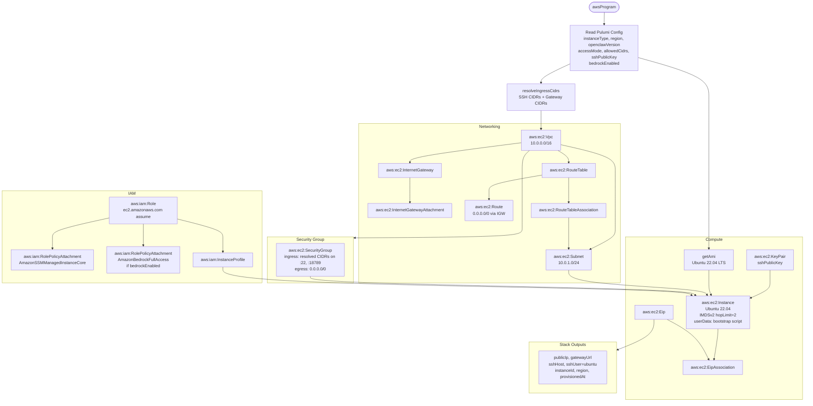

# AWS Provider

## Quick Start

```bash
# 1. Configure credentials — pick one method:

# Option A: AWS named profile (recommended for local dev)
export AWS_PROFILE=my-profile

# Option B: Access key + secret (CI / automated deployments)
export AWS_ACCESS_KEY_ID=AKIA...
export AWS_SECRET_ACCESS_KEY=...

# Option C: OIDC / web identity (GitHub Actions, etc.)
export AWS_ROLE_ARN=arn:aws:iam::123456789012:role/deploy
export AWS_WEB_IDENTITY_TOKEN_FILE=/var/run/secrets/eks.amazonaws.com/serviceaccount/token

# 2. Initialize clawops for AWS
clawops init --provider aws --region us-east-1 --state s3://my-bucket/clawops

# 3. Deploy
clawops up
```

## Credentials

clawops checks the following in order (first match wins):

| Source | Env var(s) | Notes |
|---|---|---|
| Named profile | `AWS_PROFILE` | Uses `~/.aws/credentials` or `~/.aws/config` |
| Access key | `AWS_ACCESS_KEY_ID` | Pair with `AWS_SECRET_ACCESS_KEY` |
| OIDC / web identity | `AWS_ROLE_ARN` + `AWS_WEB_IDENTITY_TOKEN_FILE` | GitHub Actions, EKS |
| EC2 instance metadata | *(auto-detected)* | Only when running on EC2 |

`clawops doctor --provider aws` validates which path will be used.

### Per the credentials policy (R6)

Credentials NEVER appear in `~/.clawops/config.json`, CLI flags, MCP tool arguments,
or audit logs. Only a `credentialsRef: { source: "env", envVars: ["AWS_PROFILE"] }` reference
is stored in config.

## Required IAM Permissions

Minimum permissions for `clawops up` / `clawops destroy`:

| Service | Actions | Notes |
|---|---|---|
| EC2 | `ec2:*Vpc*`, `ec2:*Subnet*`, `ec2:*SecurityGroup*`, `ec2:*KeyPair*`, `ec2:*Instance*`, `ec2:*InternetGateway*`, `ec2:*RouteTable*`, `ec2:*Address*` | Full lifecycle |
| IAM | `iam:CreateRole`, `iam:AttachRolePolicy`, `iam:CreateInstanceProfile`, `iam:AddRoleToInstanceProfile`, `iam:DeleteRole*`, `iam:DetachRolePolicy`, `iam:DeleteInstanceProfile`, `iam:RemoveRoleFromInstanceProfile` | Instance profile for SSM |
| S3 | `s3:GetObject`, `s3:PutObject`, `s3:DeleteObject`, `s3:ListBucket` | State backend bucket |

For `bedrockEnabled: true` add `bedrock:InvokeModel` or attach
`arn:aws:iam::aws:policy/AmazonBedrockReadOnly`.

## Resources Created

When you run `clawops up`, the AWS adapter provisions:

- **VPC** (`10.0.0.0/16`) with DNS hostnames enabled
- **Internet Gateway** + attachment
- **Subnet** (`10.0.1.0/24`) in `<region>a`
- **Route Table** with a default route to the IGW
- **Security Group** — ingress controlled by `accessMode` (see [Firewall](#firewall-model)); egress unrestricted
- **IAM Role** with EC2 trust policy + `AmazonSSMManagedInstanceCore` (SSM Session Manager)
- **IAM Instance Profile** bound to the role
- **EC2 Key Pair** from `~/.clawops/id_ed25519.pub`
- **EC2 Instance** — Ubuntu 22.04 LTS (Canonical AMI, `099720109477`), running OpenClaw via Docker
- **Elastic IP** — static public IP assigned to the instance

The initial SSH user is `ubuntu` (Ubuntu default); the startup script creates a `clawops` system user for OpenClaw operations.

## Instance Type Aliases

| Alias | Native Type | vCPU | Memory |
|---|---|---|---|
| `micro` | `t3.micro` | 2 | 1 GB |
| `small` | `t3.small` | 2 | 2 GB |
| `medium` | `t3.medium` | 2 | 4 GB |
| `large` | `t3.large` | 2 | 8 GB |
| `gpu` | `g4dn.xlarge` | 4 | 16 GB + NVIDIA T4 |

## Region Defaults

- **Default**: `us-east-1`
- **Override**: `clawops init --provider aws --region eu-west-1`

## State Backend

- **URL pattern**: `s3://<bucket>/clawops`
- **Bucket must exist** before first `clawops up`; clawops does not create it
- **Encryption**: server-side encryption is controlled by your bucket policy

## Firewall Model

The security group ingress rules are controlled by the `accessMode` stack config key:

| Mode | Behaviour | Use case |
|---|---|---|
| `restricted` *(default)* | Deny all by default; open only the CIDRs in `allowedCidrs` | Production |
| `auto` | Detect caller's public IP at deploy time; open SSH + gateway to `<ip>/32` | MCP-driven / CI deployments |
| `open` | `0.0.0.0/0` on both ports; emits a stderr warning | Sandbox / testing only |

Per-port overrides (take precedence over `accessMode`):

```bash
pulumi config set sshCidrs     "10.0.0.0/8,203.0.113.5/32"
pulumi config set gatewayCidrs "203.0.113.5/32"
```

**Default security-group rules are deny-all (N10).** Never use `open` in production.

## Bedrock Integration

Set `bedrockEnabled = true` in stack config to:

1. Attach `AmazonBedrockReadOnly` managed policy to the instance profile
2. Write `AWS_PROFILE=default` to `/etc/openclaw.env` (OpenClaw 2026.4.5+ compatibility)

```bash
pulumi config set bedrockEnabled true
clawops up
```

## OpenClaw Version Compatibility

See `spec/openclaw-versions.yaml`. AWS-specific quirk:

- **OC-2026.4.5+** requires `AWS_PROFILE` in the systemd `EnvironmentFile`, not `auth: "aws-sdk"` in `openclaw.json`. When `bedrockEnabled=true`, clawops writes `/etc/openclaw.env` automatically.

## Cost Estimate

Approximate monthly cost (us-east-1, always-on):

| Instance | On-Demand | Notes |
|---|---|---|
| `micro` (t3.micro) | ~$8/month | Not eligible for Bedrock |
| `small` (t3.small) | ~$17/month | Recommended minimum |
| `medium` (t3.medium) | ~$33/month | |
| `gpu` (g4dn.xlarge) | ~$395/month | Bedrock alternative |

Plus Elastic IP (~$3.60/month if instance is stopped), S3 state storage (< $1/month).

## Troubleshooting

| Symptom | Likely cause | Fix |
|---|---|---|
| `No AWS credentials found` | No env var or profile set | See [Credentials](#credentials) |
| `InvalidClientTokenId` | Wrong region for key | Check `AWS_DEFAULT_REGION` |
| `UnauthorizedOperation` | IAM insufficient | See [Required IAM](#required-iam-permissions) |
| SSH timeout after deploy | Security group too restrictive | Use `accessMode=auto` or set `allowedCidrs` |

```bash
clawops doctor --provider aws     # validates credentials + config
clawops plan                      # preview resources before deploying
clawops status                    # current stack state
```

## Stack diagram



## See Also

- `src/providers/aws/` — adapter + Pulumi program
- `tests/providers/aws/` — adapter + program tests
- `docs/github-actions-oidc.md` — CI/CD with OIDC
- ADR 0004 — credential policy (R6)
