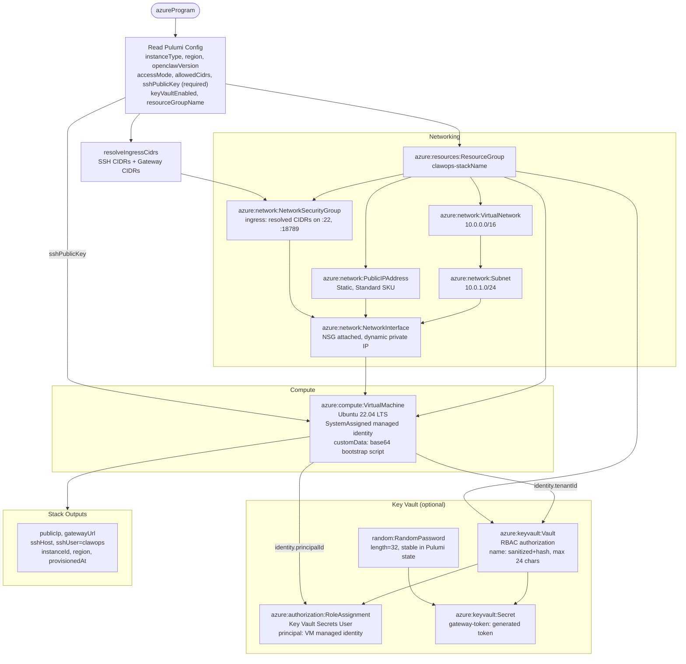

# Azure Provider

## Quick Start

```bash
# 1. Configure credentials — pick one method:

# Option A: Service principal (recommended for production)
export AZURE_CLIENT_ID=<app-id>
export AZURE_TENANT_ID=<tenant-id>
export AZURE_CLIENT_SECRET=<secret>

# Option B: OIDC / federated credentials (GitHub Actions, etc.)
export AZURE_CLIENT_ID=<app-id>
export AZURE_TENANT_ID=<tenant-id>
export AZURE_FEDERATED_TOKEN_FILE=/var/run/secrets/azure/tokens/azure-identity-token

# Option C: Managed identity (when running on an Azure VM)
# No env vars needed — detected automatically via IMDS

# 2. Initialize clawops for Azure
clawops init --provider azure --region eastus --state azblob://my-container/clawops

# 3. Deploy
clawops up
```

## Credentials

clawops checks the following in order (first match wins):

| Source | Env var(s) | Notes |
|---|---|---|
| Service principal | `AZURE_CLIENT_ID` + `AZURE_TENANT_ID` + `AZURE_CLIENT_SECRET` | Static credentials |
| Federated / OIDC | `AZURE_CLIENT_ID` + `AZURE_TENANT_ID` + `AZURE_FEDERATED_TOKEN_FILE` | GitHub Actions, workload identity |
| Azure CLI | *(none — `az login`)* | Recommended for local dev. Read from `azureProfile.json` under `$AZURE_CONFIG_DIR` or `~/.azure` |
| Managed identity | *(auto-detected)* | Only when running on an Azure VM |

The CLI login is last in that list and first in practice. Pulumi's `azure-native` provider
falls back to it when no service principal is set, so a deploy will use it — clawops used to
refuse it and demand a service principal for a credential it was about to rely on anyway.

The subscription a deploy lands in is `ARM_SUBSCRIPTION_ID`, then `AZURE_SUBSCRIPTION_ID`, then
the CLI's default — Pulumi's own order, so `doctor` reports what `apply` will use.

`clawops doctor --provider azure` validates which path will be used.

### Per the credentials policy (R6)

Credentials NEVER appear in `~/.clawops/config.json`, CLI flags, MCP tool arguments,
or audit logs. Only a `credentialsRef: { source: "env", envVars: ["AZURE_CLIENT_ID"] }` reference
is stored in config.

## Account setup clawops checks before it deploys

`clawops doctor --provider azure` runs an account-level preflight. None of this is
infrastructure and none of it belongs in the Pulumi program, but a deploy fails partway through
without it:

| Check | Why |
|---|---|
| Subscription is set | `ARM_SUBSCRIPTION_ID`, `AZURE_SUBSCRIPTION_ID`, or the CLI's default |
| `Microsoft.Compute` registered | the virtual machine and its disk |
| `Microsoft.Network` registered | the virtual network, NSG, public IP and NIC |
| `Microsoft.Storage` registered | the azblob state backend |
| azblob state backend configured | `AZURE_STORAGE_ACCOUNT` + `AZURE_STORAGE_KEY` or `AZURE_STORAGE_SAS_TOKEN` |

**A fresh subscription has no resource providers registered.** The first sign is a deploy
failing with `The subscription is not registered to use namespace 'Microsoft.Compute'`.
Registration is free, idempotent and takes a couple of minutes; `clawops setup` offers to do it
and names the subscription it will change.

**The VM size clawops asks for may not be offered to you.** Azure gates SKU families per
subscription and region: a subscription created in 2026 is commonly offered no B-series size at
all in `eastus`, which is every non-GPU size clawops names. The failure arrives late —

```
Status=409 Code="SkuNotAvailable" … 'Standard_B2s' is currently not available in location 'eastus'
```

— after the virtual network, NSG, public IP and NIC have been created. The preflight checks the
default size against what your subscription is actually offered and names alternatives; pass one
with `clawops plan --instance-type Standard_D2als_v7`. No static map is right everywhere, which
is why clawops names what you can have rather than guessing.

**The state backend does not use your `az login`.** Pulumi's azblob backend authenticates with
`AZURE_STORAGE_ACCOUNT` and a key or SAS token, so every credential check here can pass and the
deploy still fail to open its own state. Creating one:

```bash
az group create -n clawops-state-rg -l eastus
az storage account create -n <globally-unique-name> -g clawops-state-rg -l eastus \
  --sku Standard_LRS --kind StorageV2 --min-tls-version TLS1_2 --allow-blob-public-access false
KEY=$(az storage account keys list -n <name> -g clawops-state-rg --query "[0].value" -o tsv)
az storage container create -n clawops-state --account-name <name> --account-key "$KEY"

export AZURE_STORAGE_ACCOUNT=<name>
export AZURE_STORAGE_KEY="$KEY"
clawops init --provider azure --state azblob://clawops-state --region eastus
```

## Required RBAC Permissions

The service principal / managed identity needs the following roles on the subscription
(or a narrower scope like a resource group):

| Role | Scope | Notes |
|---|---|---|
| **Contributor** | Subscription / Resource Group | Create and manage all clawops resources |
| **Key Vault Administrator** | Key Vault (if `keyVaultEnabled=true`) | Assign secrets; can be narrowed to Key Vault Secrets Officer |

For state backend (Azure Blob Storage), assign **Storage Blob Data Contributor** on the
storage account.

## Resources Created

When you run `clawops up`, the Azure adapter provisions:

- **Resource Group** (`clawops-<stackName>` by default)
- **Virtual Network** (`10.0.0.0/16`)
- **Subnet** (`10.0.1.0/24`)
- **Network Security Group** — ingress controlled by `accessMode` (see [Firewall](#firewall-model))
- **Public IP Address** (Static, Standard SKU) — persistent across VM restarts
- **Network Interface** wiring subnet, pip, and NSG
- **Virtual Machine** — Ubuntu 22.04 LTS, SystemAssigned managed identity, running OpenClaw via Docker
  - Admin user: `clawops`
  - SSH public key injected at `/home/clawops/.ssh/authorized_keys`
- *(Optional)* **Key Vault** + **Role Assignment** + **Secret** if `keyVaultEnabled=true`

## Instance Type Aliases

| Alias | Native Type | vCPU | Memory |
|---|---|---|---|
| `micro` | `Standard_B1s` | 1 | 1 GB |
| `small` | `Standard_B2s` | 2 | 4 GB |
| `medium` | `Standard_B4ms` | 4 | 16 GB |
| `large` | `Standard_B8ms` | 8 | 32 GB |
| `gpu` | `Standard_NC6s_v3` | 6 | 112 GB + NVIDIA V100 |

## Region Defaults

- **Default**: `eastus`
- **Override**: `clawops init --provider azure --region westeurope`

## State Backend

- **URL pattern**: `azblob://<container>` — a container, addressed directly, with no state
  prefix. The other two providers take `<bucket>/clawops`; Azure does not
- **Default name**: `clawops-state`. The container is already scoped by the storage account, so
  clawops adds no discriminator to it
- **Storage account and container must exist** before first `clawops up`. clawops will not create
  the storage account: Pulumi's azblob backend authenticates with `AZURE_STORAGE_ACCOUNT` plus a
  key or SAS token, and clawops does not hold that key (R6). This is the one account check it
  reports without offering a fix
- **Encryption**: Azure Storage encrypts at rest by default

## Firewall Model

NSG security rules are controlled by the `accessMode` stack config key:

| Mode | Behaviour | Use case |
|---|---|---|
| `restricted` *(default)* | Deny all by default; open only the CIDRs in `allowedCidrs` | Production |
| `auto` | Detect caller's public IP at deploy time and open SSH to `<ip>/32` | MCP-driven / CI deployments |
| `open` | `0.0.0.0/0` on both ports; emits a stderr warning | Sandbox / testing only |

Per-port overrides (take precedence over `accessMode`):

```bash
pulumi config set sshCidrs     "10.0.0.0/8,203.0.113.5/32"
pulumi config set gatewayCidrs "203.0.113.5/32"
```

**No gateway rule is created under loopback publishing**, which is the default. The gateway binds
`127.0.0.1`, so an NSG rule for its port would grant no access and misread as exposure. Gateway
rules exist only with `--publish-gateway all`, and then only for the CIDRs you name.

**Default NSG rules are deny-all (N10).** Never use `open` in production.

**Egress.** Unrestricted by default. The host needs outbound access to `download.docker.com`
and your package mirrors at first bootstrap, `ghcr.io` for the image, and — new in 2.0 —
`clawhub.ai` **during `apply`** to install model-provider plugins. See
[required outbound access](../security/egress.md) for what each failure looks like.

## Key Vault Integration (Optional)

Set `keyVaultEnabled = true` to provision an Azure Key Vault and store the OpenClaw
gateway token as a secret:

```bash
pulumi config set keyVaultEnabled true
clawops up
```

This provisions:
1. `azure-native:keyvault:Vault` named `clawops-<stackName>-kv` (max 24 chars enforced)
2. `azure-native:authorization:RoleAssignment` — **Key Vault Secrets User** role for the VM's managed identity
3. `azure-native:keyvault:Secret` — placeholder `gateway-token` (update with your real token)

The VM's SystemAssigned identity can read the secret without credentials in config.

## OpenClaw Version Compatibility

See `spec/openclaw-versions.yaml`. Azure-specific notes:

- VM identity is **SystemAssigned**; no user-assigned identity setup is required
- `customData` (base64-encoded startup script) installs Docker and starts OpenClaw on first boot

## Cost Estimate

Approximate monthly cost (East US, always-on):

| Instance | Pay-as-you-go | Notes |
|---|---|---|
| `micro` (Standard_B1s) | ~$8/month | |
| `small` (Standard_B2s) | ~$30/month | Recommended minimum |
| `medium` (Standard_B4ms) | ~$60/month | |
| `gpu` (Standard_NC6s_v3) | ~$850/month | |

Plus Static Public IP (~$3/month), managed disk (~$2/month), state storage (< $1/month).
Key Vault costs ~$0.03/10,000 operations.

## Troubleshooting

| Symptom | Likely cause | Fix |
|---|---|---|
| `No Azure credentials found` | Env vars missing | See [Credentials](#credentials) |
| `AuthorizationFailed` | RBAC role too narrow | See [Required RBAC](#required-rbac-permissions) |
| `InvalidVaultName` | KV name > 24 chars | clawops auto-truncates; verify stack name |
| SSH timeout after deploy | NSG too restrictive | Use `accessMode=auto` or set `allowedCidrs` |
| `PublicIPAddress.ipAddress is undefined` | Static IP not yet assigned | Wait ~30s and retry `clawops status` |

```bash
clawops doctor --provider azure    # validates credentials + config
clawops plan                       # preview resources before deploying
clawops status                     # current stack state
```

## Stack diagram



## See Also

- `src/providers/azure/` — adapter + Pulumi program
- `tests/providers/azure/` — adapter + program tests
- `docs/github-actions-oidc.md` — CI/CD with OIDC / federated credentials
- ADR 0004 — credential policy (R6)
